# Arcon: Micro-Investing Platform

**Arcon** is a modern, compliant micro-investing application designed to help users grow their wealth effortlessly. By automatically investing "spare change" from everyday digital transactions, Arcon makes financial growth accessible to everyone.

 

---

## 🛡️ How It Really Works (RBI/NPCI Compliant)

Arcon operates on a strict **Compliance-First** model. Unlike older methods that might scrape data or claim immediate post-transaction debits, we adhere strictly to RBI and NPCI guidelines for user safety and data privacy.

### The Truth About Round-Ups
*   **No Direct Access**: We do NOT see or read your individual UPI transactions in real-time.
*   **No Instant Debits**: We do NOT deduct ₹3 immediately after you buy a ₹247 coffee.
*   **No Unauthorised Charges**: Every debit is backed by a verified UPI Mandate.

### The Mechanism: Daily Aggregation & One-Time Debit
Instead of reacting to every transaction individually, Arcon uses a smart aggregation engine:

1.  **Spare Change Estimation**: 
    - We estimate your daily round-ups based on your spending profile or optional SMS inputs (where permitted).
    - *Example*: You spent ₹247. We calculate the round-up to ₹250 is **₹3**.
    - We track these small amounts locally throughout the day: ₹3 + ₹5 + ₹12 = **₹20**.

2.  **Daily Aggregation**: 
    - We do not touch your bank account for each small amount.
    - Instead, we sum up the total spare change for the day (e.g., **₹20**).

3.  **Single Compliant Debit**: 
    - Once a day (or week, based on preference), we execute **ONE** single debit via your pre-authorized **UPI AutoPay Mandate**.
    - This ensures valid, recurring payments without cluttering your bank statement with tiny transactions.

4.  **Instant Investment**: 
    - The aggregated amount (₹20) is immediately allocated to your chosen portfolio (Mutual Funds or Digital Gold).

> "Every day, we automatically invest a small amount based on your everyday spending. Instead of investing after each purchase, we combine small amounts and invest them once a day using UPI AutoPay. This keeps your money safe, compliant, and hassle-free."

---

## � User Story: Parth's Journey

Let's see exactly how Arcon works for a user named **Parth**.

```mermaid
graph TD
    subgraph Onboarding
        Start([Parth Downloads App]) --> KYC[Verify KYC]
        KYC --> Mandate[Set UPI AutoPay Mandate<br/>Max ₹5000/month]
    end

    subgraph Daily_Life [Parth's Daily Life]
        Coffee[Parth buys Coffee: ₹247] -->|Round Up to ₹250| Calc1(App tracks: ₹3)
        Lunch[Parth buys Lunch: ₹118] -->|Round Up to ₹120| Calc2(App tracks: ₹2)
        Calc1 & Calc2 --> Total(Daily Total: ₹5)
    end

    subgraph Automated_Investing [Arcon Logic]
        Total -->|Next Morning| Debit[UPI AutoPay Debit: ₹5]
        Debit -->|Invest| Portfolio[Gold/Equity Portfolio]
        Portfolio -->|Notify| Alert[Parth gets Notification:<br/>'₹5 Invested!']
    end

    Mandate -.-> Debit
```



---

## �🚀 Key Features

*   **Auto-Invest Status**: Clear, color-coded indicators (Active, Paused, Action Required) so you always know your standing.
*   **Smart Contextual Experience**: The home screen adapts to your journey—prompting KYC only when needed, showing portfolio value when active.
*   **" This Month's Drop"**: Visual progress tracker showing how small contributions add up over the month.
*   **Portfolio Snapshots**: Simple, jargon-free breakdown of your Equity, Debt, and Gold allocations.
*   **AI Financial Assistant**: Personalized, friendly insights to keep you motivated.

---

## 🛠️ Technology Stack

### Frontend (Mobile App)
*   **Framework**: Flutter (Dart)
*   **Design**: Custom "Premium Fintech" Theme (Clean, Minimal, Trust-Focused)
*   **State Management**: `StatefulWidget` & Local State (MVP)
*   **Networking**: `http` package with interceptors for Auth

### Backend (API)
*   **Framework**: Python (Flask)
*   **Database**: SQLite (Dev) / PostgreSQL (Prod)
*   **ORM**: SQLAlchemy
*   **Authentication**: JWT (JSON Web Tokens)
*   **Documentation**: Swagger/OpenAPI (`/api/docs`)

---

## 🏁 Getting Started

### Prerequisites
*   Flutter SDK (3.0+)
*   Python 3.8+
*   Git

### Installation

1.  **Clone the Repository**
    ```bash
    git clone https://github.com/yourusername/arcon.git
    cd arcon
    ```

2.  **Backend Setup**
    ```bash
    cd backend
    python -m venv venv
    source venv/bin/activate  # or venv\Scripts\activate on Windows
    pip install -r requirements.txt
    
    # Run the server
    python -m backend.app
    ```
    *Server runs on `http://localhost:5000`*

3.  **Frontend Setup**
    ```bash
    cd frontend
    flutter pub get
    
    # Run the app (ensure backend is running)
    flutter run -d chrome  # or emulator
    ```

---

## ☁️ Cloud-Native Infrastructure (DevOps)

Arcon utilizes a modern, containerized architecture orchestrated by Kubernetes.

### The Stack
*   **Containerization**: Docker (Multi-stage builds for frontend).
*   **Orchestration**: Kubernetes (Deployments, Services, Ingress).
*   **CI/CD**: Jenkins (Build/Push) + ArgoCD (GitOps Deployment).

### CI/CD Pipeline Flow


### Setup Guide
For detailed instructions on running the Docker containers locally or deploying to K8s, refer to the [DevOps Walkthrough](docs/devops.md).

---

## 🔒 Security & Privacy

*   **Bank-Grade Security**: All API traffic is encrypted.
*   **Data Minimization**: We only store what is absolutely necessary for investment execution.
*   **Transparent Permissions**: We never access SMS or localized data without explicit, revocable user consent.

---

© 2026 Arcon. All Rights Reserved.
